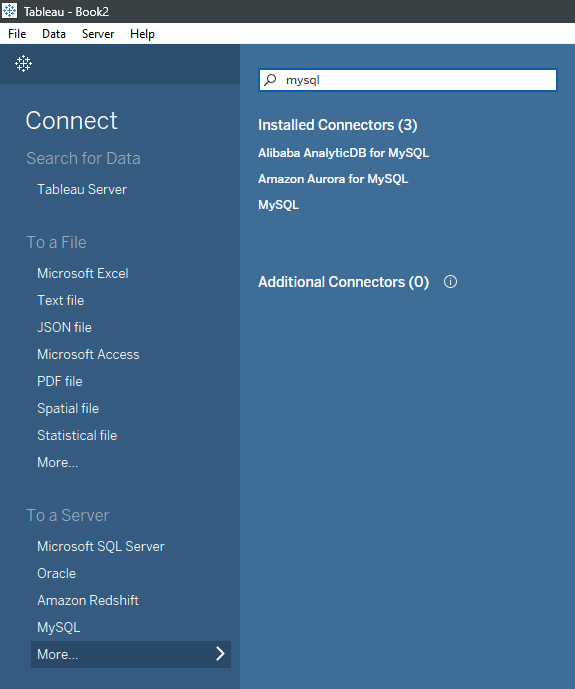
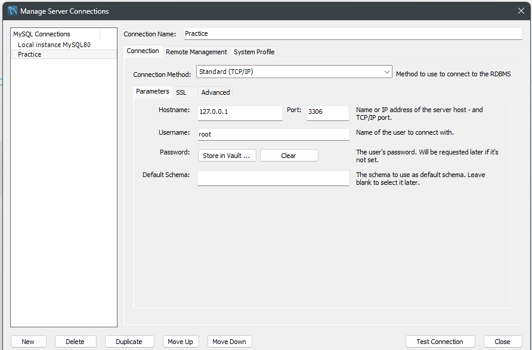
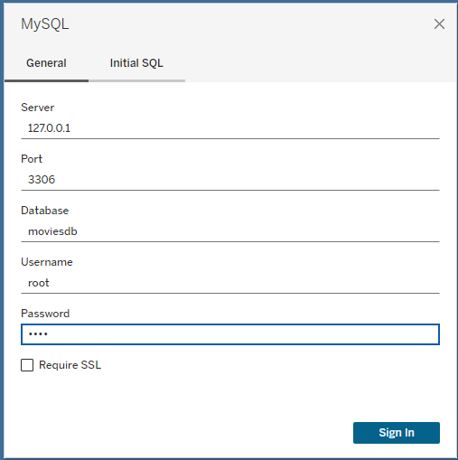
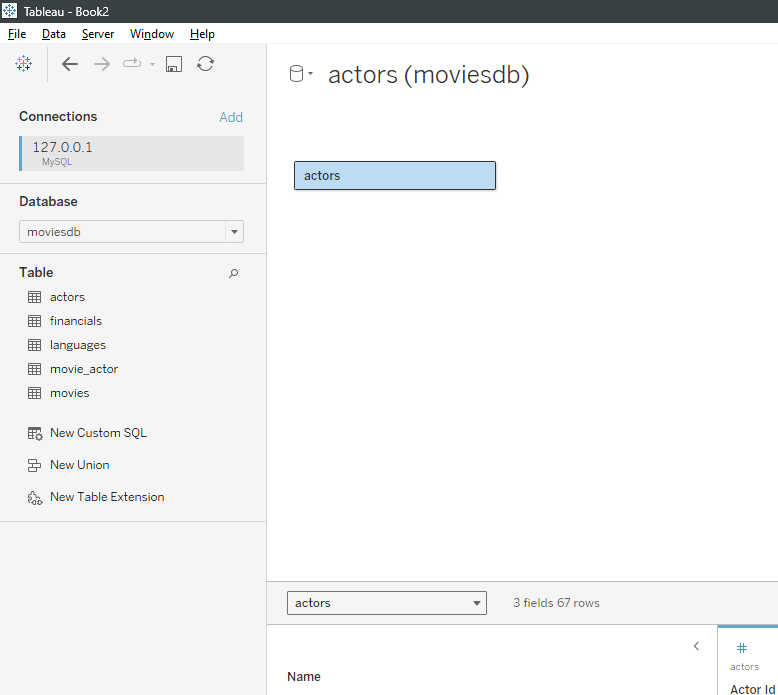
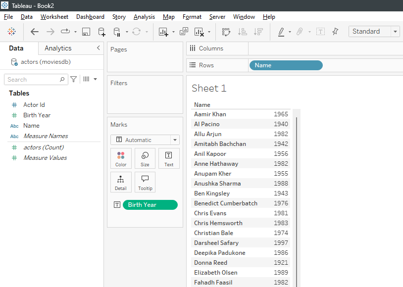
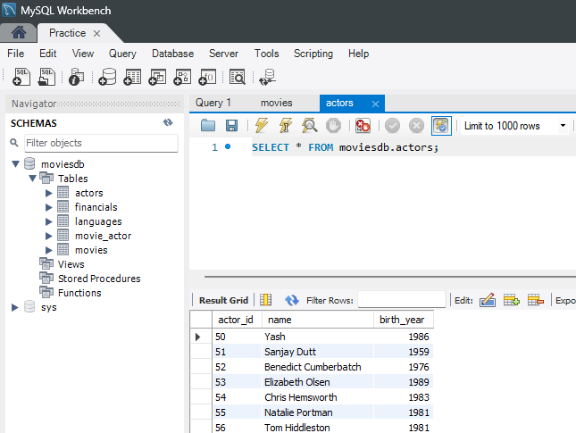

[📌 Click Here to View Documentation](https://aravaravind.github.io/Tableau-MySQL-Connection/)
# Tableau-MySQL-Connection

A step-by-step guide on connecting **Tableau** to a **MySQL** database. 🚀  

## Prerequisites  

- MySQL Server installed  
- Tableau installed  
- MySQL Connector for Tableau installed – [Download Here](https://dev.mysql.com/downloads/connector/odbc/)  

## Steps to Connect Tableau to MySQL  

1. Open **Tableau Desktop**.  
2. Click on **More...** under the "To a Server" section, then select **MySQL**.  

     

3. Enter the server details:  
   - **Server**: Typically `localhost:port_number` (e.g., `127.0.0.1:3306`)  
   - **Database Name**: `moviesdb`  
   - **Username** and **Password**: Enter your MySQL credentials  
   - Click **Sign In**  

     

     

4. Once connected, you should see your MySQL database in Tableau.  

     

     

     

## Notes  

- Ensure **MySQL Server** is running before attempting to connect.  
- Use the correct **MySQL Connector** version for compatibility.  
- If you encounter issues, check your firewall settings and MySQL configuration.  

## Author  

[Aravind R](https://linkedin.com/in/arav-r)  
